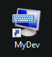
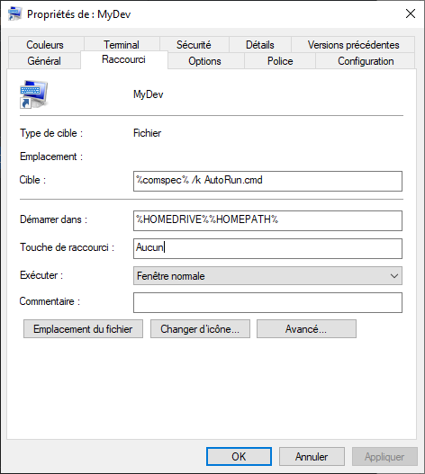

# Windows Command improvement

Try to answer lots of questions.


## Code Page

With command you have not always UTF8 encoding.\
It's something else depending of your system configuration (local).

This sucks because you can not have special characters like é ç à è ... in your command files (.cmd).

What is your CP?\
In Command type:

``` cmd
chcp
```

In my computer the answer is 850. This is not UTF8.

To have UTF8 I have to type:

``` cmd
CHCP 65001
```

Now I'm in UTF8 but it's not permanent.


## AutoRun with Command ?

It's possible if you play with the registry of Windows.\
I do not recommand that, avoid it.\
And if your not admin, you can not do it.\
So Forgot this way.

## Use shortcut

This is the best way. No need to be admin.\
Just create a shortcut. Here I change the icon as I wish.




With target:

``` cmd
%comspec% /k
``` 

Double clic your shorcut and it lauch the Windows Command.\
Tune it as you wish, colors, etc.\
Close.\
Right clic on your shorcut, Parameters, tune evrything.\
You have a parameter like "start in".\
Change it to have:

``` cmd
%HOMEDRIVE%%HOMEPATH%
```

## Want a profile

The easy way is to have a directory in your path.\
You can do that even if you are not admin of the computer.\
This directory is where you put all your cmd files.\
Inside, put all the .cmd files.

### The AutoRun.cmd

In the Shortcut, change the target to be :

``` cmd
%comspec% /k AutoRun.cmd
``` 




You can add if you want a key shortcut, for example:\
CTRL + ALT + C

Each time you type this 3 keys, the Command start.

It's in French because I'm french.

Now each time you lauch Command with your shortcut, evrything in the AutoRun.cmd apply.

### about CALL

The CALL command permit to avoid problems.\
For example, the Set-Prompt.cmd change the prompt.

more about call : https://ss64.com/nt/call.html


# Conclusion

So far so good, do what you want.\
You can have a shortcut for each feature you need.\
Python, Git, Node.js, etc.

You can manage different versions, etc.
___